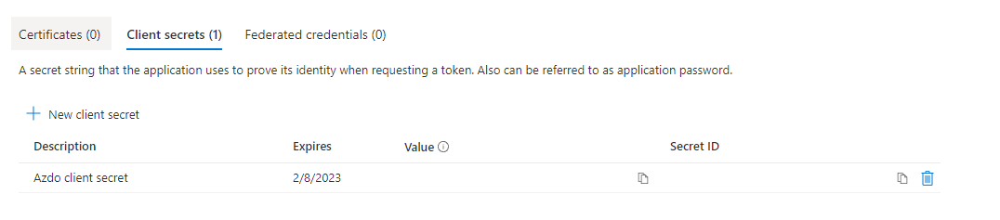
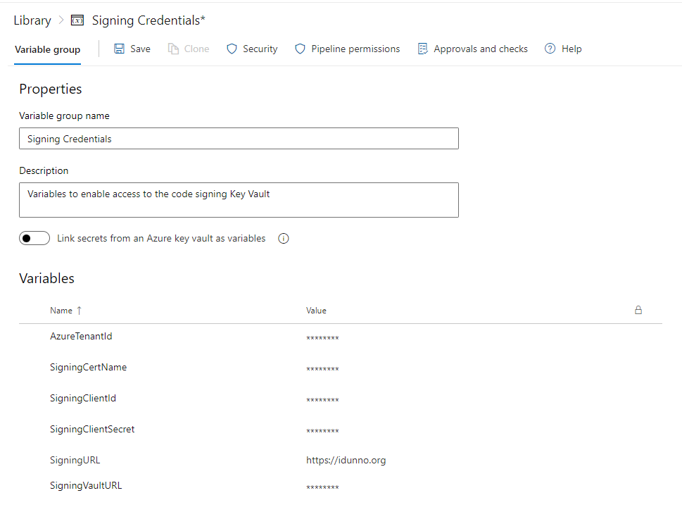

# Code & nuget signing in Azure Pipelines

## Introduction

For a while, because we won't include it in .NET, I've had an implementation of the perfectly horrible and insecure [HTTP Basic Authentication](https://github.com/blowdart/idunno.Authentication) which is disturbingly popular. As the .NET Security PM I've signed the code with a codesigning certificate from [Digicert](https://www.digicert.com/signing/code-signing-certificates), signing both the assemblies themselves with Authenticode and the nuget packages which contain the assemblies. 

Previously I'd done this manually, extract files from the nuget package to sign, running [signtool](https://docs.microsoft.com/en-us/windows/win32/seccrypto/signtool) with the private key of the Authenticode certificate stored on a [Yubikey](https://www.yubico.com/products/yubikey-5-overview/) and then running `nuget sign`  using the [nuget tooling](https://docs.microsoft.com/en-us/nuget/create-packages/sign-a-package). However recent changes to codesigning standards increased the RSA private key size to 3072 bits,which is larger that a Yubikey can store in [Personal Identity Verification (PIV)](https://csrc.nist.gov/projects/piv/piv-standards-and-supporting-documentation) mode. PIV allowed me to keep the private key away from the local hard drive and on the Yubikey, protected behind a PIN and only ever inserted when I needed to sign. While Authenticode signing supports [ECC](https://en.wikipedia.org/wiki/Elliptic-curve_cryptography) certificates, and their much smaller private key information would still fit on a Yubikey, nuget signing is limited to [RSA](https://en.wikipedia.org/wiki/RSA_(cryptosystem))() keys which means either putting the certificate on your hard drive, putting the certificate and private key into the Windows Certificate Store. Leaving your code signing private key hanging around on your computer is a bad idea, they're a [common target in breaches](https://arstechnica.com/information-technology/2016/03/to-bypass-code-signing-checks-malware-gang-steals-lots-of-certificates/) and, once stolen, end up signing malware. I could, of course, purchase an HSM for home, but that's rather expensive and having purchased a house built in 1901 that money could go to better insulation for the crawl space so my feet stay warmer. Finally, manually signing is just a pain in the ass.

So, I already have a build pipeline, why not automate the signing. Azure Pipelines' codesigning implementation has never made me feel comfortable, it's mostly aimed at mobile apps and it requires you to put your codesigning certificate as a secret in the pipeline properties. Azure has a much better place to keep certificates, [Azure Key Vault](https://azure.microsoft.com/en-us/services/key-vault), but there's no official, Microsoft provided, software to sign code or nuget packages from a certificate stored safely in Key Vault. Luckily the community provides, through [AzureSignTool](https://github.com/vcsjones/AzureSignTool) and [NuGetKeyVaultSignTool](https://github.com/novotnyllc/NuGetKeyVaultSignTool) but putting everything together, and blog posts exist for both of these tools separately.

In this document I attempt to show you how to put everything together in one Azure Pipeline, showing how to compile your code, sign the assemblies, sign the nuget package and finally publish the signed artifacts, with Sean Killeen documenting how to [sign assemblies](https://seankilleen.com/2020/05/how-to-use-azuresigntool-to-sign-files-with-azure-devops-using-a-certificate-in-azure-keyvault/) and Joseph Guadagno documenting how to [sign nuget packages](https://www.josephguadagno.net/2020/04/12/build-sign-and-deploy-nuget-packages-with-azure-pipelines). 

The goal is to have [nuget package explorer](https://github.com/NuGetPackageExplorer/NuGetPackageExplorer) happy with the nuget signature, including a reproducible build,


and for the assemblies inside the packages to be Authenticode signed,


without having to do anything by hand and leaving the code signing key happily locked away in Key Vault.

## Prerequisites

You will need the following

1) An Azure Subscription
2) A build pipeline which already compiles your code, and is already hooked up to a GitHub repository to compile on check in. The pipeline should produce nuget packages as its output.
3) A code signing certificate. I use [Digicert](https://www.digicert.com/signing/code-signing-certificates) because I know some folks there, and when I was a Microsoft MVP they'd give you a free code signing certificate, but [Sectigo](https://sectigo.com/ssl-certificates-tls/code-signing) also supply them, at a cheaper price point.
4) (Optionally) An absolute loathing of YAML and a feeling we'd be better off just sticking to XML instead of using a document format that uses indentation as a delimiter, an approach that should have gone away with COBOL.

Please note that Azure changes its administration UI almost as often as a new browser UI framework appears, so you may have to hunt around to find the screens and forms needed to set things up. This document was accurate in February 2022.

## Starting with a build script

The starting point is a typical build script, already configured in Azure Pipelines to trigger when something interesting happens in the GitHub repository.

```yaml
# Build, test and package idunno.Authentication nuget packages

trigger:
- dev
- rel/*

pr:
- dev
- rel/*

variables:
  solution: '**/*.sln'
  DOTNET_SKIP_FIRST_TIME_EXPERIENCE: true
  DOTNET_NOLOGO: true
  DOTNET_CLI_TELEMETRY_OPTOUT: true
  buildPlatform: 'Any CPU'
  buildConfiguration: 'Release'

stages:
- stage: Build
  jobs:
  - job: Build
    pool:
      vmImage: 'windows-latest'

    steps:
    # .NET 6
    - task: UseDotNet@2
      displayName: 'Install .NET Core 6.0.x SDK'
      inputs:
        version: '6.0.x'
        packageType: 'sdk'

    # NetCoreApp 3.0 & 3.1 Support
    - task: UseDotNet@2
      displayName: 'Install .NET Core 3.1.x SDK'
      inputs:
        version: '3.1.x'
        packageType: 'sdk'

    # NetStandard 2.0 Support
    - task: UseDotNet@2
      displayName: 'Install .NET Core 2.1.x runtime'
      inputs:
        version: '2.1.x'
        packageType: 'runtime'

    # Install nerdbank versioning tool
    # https://github.com/dotnet/Nerdbank.GitVersioning/blob/master/doc/nbgv-cli.md
    - task: DotNetCoreCLI@2
      displayName: Install NBGV tool
      inputs:
        command: custom
        custom: tool
        arguments: install --tool-path tooling nbgv

    - script: tooling\nbgv cloud
      displayName: Build Version Properties

    # Build
    - task: DotNetCoreCLI@2
      displayName: dotnet build
      inputs:
        command: build
        projects: '**/*.csproj'
        arguments: '--configuration $(buildConfiguration)'

    # Run tests
    - task: DotNetCoreCLI@2
      displayName: dotnet test
      inputs:
        command: test
        projects: '**/test/**/*.csproj'
        arguments: '--configuration $(buildConfiguration) --settings $(Build.SourcesDirectory)/tests.runsettings --collect:"XPlat Code Coverage" -- RunConfiguration.DisableAppDomain=true'

    # Produce unsigned packages
    - task: DotNetCoreCLI@2
      displayName: "dotnet pack"
      inputs:
        command: 'pack'
        outputDir: '$(Build.ArtifactStagingDirectory)/Packages'
        configuration: $(buildConfiguration)
        arguments: '/p:IncludeSymbols=true'
        verbosityPack: minimal
        packagesToPack: '**/src/**/*.csproj'
        nobuild: true

    # Publish unsigned packages
    - publish: $(Build.ArtifactStagingDirectory)\Packages
      displayName: Publish artifacts
      artifact: BuildPackages
```

This is all pretty standard stuff,  with the output from the build being the nuget packages containing unsigned code.

## Adding signing to your pipeline

Signing a nuget package needs two steps, the signing of the assemblies themselves with Authenticode, then signing the nuget packages containing the assemblies.

### Importing your certificate

The first thing to do is get our code signing key into Azure Key Vault so it's safely locked away and can't leak (unless you leak your tokens, but that nightmare is beyond the scope of this document). After logging into the [Azure Portal](https://portal.azure.com/) with your admin account (which obviously isn't your day to day account, and has MFA configured right?) go to the [Key vaults blade](https://portal.azure.com/#blade/HubsExtension/BrowseResource/resourceType/Microsoft.KeyVault%2Fvaults). Click on Create,   choose your resource group (or create a new one), name your Key Vault (in this case `MySigningKeys`), and select your pricing tier. Standard is, well standard, but you can choose HSM backed keys with Premium.


I like turning purge protection on because I'm paranoid about deleting the wrong thing, but while you're just messing around you can leave it off. Click `Review and Create` and then confirm by clicking "`Create`" and wait for the deployment to complete. Once the deployment has completed click `Go to resource` and you'll see the details of the newly created vault.


Make a note of the Vault URI, you will need it later. Do the same for the Directory ID, this is your Azure Tenant ID.

Now it's time to upload your certificate. In the menu for the Key Vault instance you can see a Settings grouping, with a Certificates menu option. Click it and you'll see a `+ Generate / Import` link. Click it and change the `Method Of Client Creation` drop down to `Import`. Enter a descriptive name for the certificate, and make a note of it, then select the certificate file to upload and enter the pfx password. The password is the one you set when you exported the certificate, or the one provided by the CA when you requested a pfx.


Click "`Create`" and your certificate will be uploaded and imported and is now safe and secure inside Key Vault. So safe and secure you can't access it.

 If you don't have a pfx file containing your certificate but the certificate is your Windows Certificate store you can create one by opening `mmc.exe`, use `File > Add/Remove Snap-in`, and select the Certificates snap-in, scope it to the account your certificate is in (typically the My user account). Open the Personal\Certificates folder then right click on your certificate, select `All Tasks>Export..` and go through the wizard. Make sure to select "Yes, export the private key", then on the security dialog check the Password check box, enter a strong password and change the encryption to be AES256-SHA256.

### Granting access to the certificate

We need a "thing" to grant access to before we can use the certificate, for Azure Active Directory that thing is an application. This isn't an executable or anything of that ilk, it's "just" an entry in AAD. Open the Active Directory blade in the Azure Portal and select the "App registrations" entry in the Manage section of the menu. Click `+ New Registration` and enter a descriptive name for the application, for example CodeSigningPipeline. You don't need to enter a Redirect URI, and you should limit the application to being a single tenant application, which is the default.


Click on `Register` and you'll be taken to the details for the new application. Make a note of the Application (client) ID.


Now, while you're still on the Application Overview Page click the Certificates & secrets menu item, select `+ New client secret`, enter a descriptive description and set the expiration date. As codesigning certificates last for a year you can select an expiration date a year in the future. Just remember when you update your certificate with a new one you're going to have to generate a new client secret and update your pipeline. When you click `Add` you'll be taken to the secret list page. Here you can see the value of the secret. This is the *only* time you will ever see the value, if you navigate away the secret will never be displayed again. Make a note of the secret value.



Now we have the client created we can grant permissions to it for accessing the key. Switch back to the Key Vault blade for the vault containing your code signing key and select Access policies from the menu. You'll see there's already an access policy for your administrative user. Click `+ Add Access Policy` and set the following permissions under Key Permissions

| Permission Type         | Permission              |
| ----------------------- | ----------------------- |
| Key permissions         | Verify, Sign, Get, List |
| Secret permissions      | Get, List               |
| Certificate permissions | Get, List               |

Then click select principal and enter the name of application you created to search for the client application. Click the application then click the `Select` button. Finally click `Add` to create the new access policy.

### Secrets Checklist

You should now have the following details for your Key Vault and AD Application which will enable you to access the certificate from your Azure Pipeline:

* Azure Tenant ID (the Directory ID from the overview page for your Key Vault, also available from the Overview Page of your Azure Active Directory),

* Key Vault URI (from the overview page for your Key Vault),
* The name of the code signing certificate in Key Vault (Created during certificate import and also available from the Certificates list in your Key Vault details),
* Application/Client ID (from the Azure Active Directory application overview page),
* Application Secret (from creating a new application secret).

### Testing locally

You can test the AzureCodeSign tool locally on Windows (as Authenticode is an undocumented black box the AzureCodeSign tool will only run on Windows). Create a temporary directory, copy one of your unsigned assemblies into it, open PowerShell (you're using [Windows Terminal](https://docs.microsoft.com/en-us/windows/terminal/install) right?), install the AzureCodeSign tool with `dotnet tool install azuresigntool` then run the following, replacing the parameter values with the secrets from the checklist above and filename.dll with your test file:

```powershell
azuresigntool.exe sign `
  -du "https://yourdomainname" `
  -fd sha512 `
  -tr http://timestamp.digicert.com `
  -td sha384 `
  -kvu keyVaultURI `
  -kvt tenantID `
  -kvi clientID `
  -kvs clientSecret `
  -kvc certificateName `
  -v `
  -ifl filename.dll
```

The `-du` optional parameter is a description url, which is meant as a link to more information about signing content.

### Configuring the build pipeline

#### Placing access secrets into a variable group

Obviously you don't want to hardcode all those secret values into your pipeline yaml for everyone to see, that would be rather silly. Open up your [Azure Devops](https://dev.azure.com/) admin page, select your project and then select your pipeline. The first thing we need to do as add all those secrets as, well, secrets. Under the Pipelines menu heading click Library. The pipeline library contains variables and secure files. The whole point of putting your certificate in Key Vault is to avoid the file ended on your build file system so secure files can be ignored. Click `+ Variable Group` to create a new variable group to contain the details needed to access the certificate. Create a descriptive Variable group name, add a description so you don't forget what it's for, and then click `+ Add` to add each of the secrets from the checklist above. If you want to use the description URL value for Authenticode you can add that too. 



As you enter each secret click the unlocked item to change it to locked so the variable is marked as a secret so you'll never see it again in portal.  Once you're done, save your variable group. If you just want to cut and paste the sample code you should name your variables like mine.

Finally you need to grant your build service access to the new variable group. In the Variable Groups List under library click the vertical ellipsis and choose Security


In the Assign Security Roles pop -up click `+ Add`and search for Build Service, and assign the Reader role. If you don't do this your pipeline will pause, warning you it doesn't have permissions to the secret group and you can assign the role from that alert.

#### Isolating signing in a separate environment

Typically [Azure Pipelines environments](https://docs.microsoft.com/en-us/azure/devops/pipelines/process/environment) are a collection of resources for deployment. The important feature we want to use is they're isolated. We never want the main build pipeline to have access to the secrets used for codesigning, especially in open source projects where you may build code you've never seen or validated when someone creates a PR. Such code could look at the environment variables for the build environment and send them elsewhere, and if those environment variables contain your certificate access secrets now you have a major problem.

Under the Pipelines menu in the DevOps portal select Environments and click `New Environment`, enter a descriptive name for the environment, which you'll use in the pipeline yaml, and a description, leave Resource as none, and click `Create`. Now select the newly created environment by clicking on it and click the vertical ellipsis button (`⋮`) and select the Security option. You'll see a list of permissions, including Pipeline permissions section. Click `+` to display a list of your pipelines and select the pipeline you will be codesigning in.


If you don't do this your pipeline will pause, warning you it doesn't have permissions to the environment and you can assign the role from that alert.

Now we have a separate environment we can use for code signing without worrying about running code from untrusted sources.

### Adding signing to an existing pipeline

First we need to add a new stage to the build definition

```yaml
- stage: CodeSign
  dependsOn: Build
  condition: |
    and(
      succeeded('Build'),
      startsWith(variables['Build.sourceBranch'], 'refs/heads/rel'),
      not(eq(variables['build.reason'], 'PullRequest'))
    )
```

We're qualifying this signing to depend on the build stage (build being the stage name of the original stage, you may have called it something else). We also are excluding pull requests for a signing build, and only signing builds that are part of release branches (my release branches are all in the format rel/version). You will want to adjust the branch detection to something that makes sense for you, but you must exclude pull requests for any projects that take PRs from the public due to the risk of running unknown code automatically.

Now we get sneaky with the environment, which needs have some extra yaml entries it to work

```yaml
  jobs:
  - deployment: CodeSign
    displayName: Code Signing
    pool:
      vmImage: windows-latest
    environment: Signing Isolation
    variables:
    - group: Signing Credentials
    strategy:
      runOnce:
        deploy:
```

Remember environments are meant for deployments, so we need extra settings to get it created, configured and to a point to where we can start running steps. The steps for the code signing portion of our build will come after the deploy node. 

With the variables node we're telling Pipelines that in this job we can access our variable group:

    variables:
    - group: Signing Credentials

This injects our Key Vault access secrets into the signing environment.

For signing itself the first step we need to perform is signing the assemblies we created during our build. However we don't have those assemblies any more, we have the artifacts created during the build, which are nupkgs. We have to crack those open so we can access the assemblies and the repack the signed assemblies as a nupkg once more. To do this we look take our build output packages, rename them from .nupkg to .zip (because nupkgs are just zip files with a standard structure), extract the zip contents, delete the files and directories that `nuget pack` creates, as they'll be recreated once we're done, then iterate though the extracted contents building a list of files that need signing, sign them, then repack the nupkgs.

```yaml
          steps:
          # Install nuget tool
          - task: NuGetToolInstaller@1

          # Install azuresigntool
          # https://github.com/vcsjones/AzureSignTool
          - task: DotNetCoreCLI@2
            displayName: Install AzureCodeSign tool
            inputs:
              command: custom
              custom: tool
              arguments: install --tool-path tooling azuresigntool

          - task: PowerShell@2
            displayName: Expand build output nupkgs
            inputs:
              # We need to extract the assemblies we built in the build stage from
              # the build output nupkgs to authenticode sign them
              targetType: inline
              script : |
                 Get-ChildItem $(Pipeline.Workspace)\BuildPackages\*.nupkg | Rename-Item -NewName {$_.name -Replace '\.nupkg$', '.zip' }
                 Get-ChildItem -Path "$(Pipeline.Workspace)\BuildPackages\*.zip" |
                 Foreach-Object {
                    Write-Host "Expanding" $_.FullName
                    $DestinationDirectory =  $_.FullName.replace('.zip', '')
                    Expand-Archive $_.FullName -DestinationPath $DestinationDirectory
                    # Delete the things that will be recreated by the nuget pack command
                    Remove-Item -Recurse -Force "$DestinationDirectory\_rels"
                    Remove-Item -Recurse -Force "$DestinationDirectory\package"
                    # To remove [Content-Types].xml we have to get creative, as [ and ] are pattern matching characters
                    Get-ChildItem $DestinationDirectory | Where-Object Name -Like '`[Content_Types`].xml' | ForEach-Object { Remove-Item -LiteralPath $_.FullName }
                 }

          - task: PowerShell@2
            displayName: Sign assemblies extracted from nupkgs
            env:
              SigningUrl: $(SigningURL)
              SigningCertificate: $(SigningCertName)
              SigningClientId: $(SigningClientId)
              SigningClientSecret: $(SigningClientSecret)
              SigningVaultUrl: $(SigningVaultURL)
              TenantId: $(AzureTenantId)
            inputs:
              # Build a file list of extracted assemblies to sign that we know are ours.
              targetType: inline
              script: |
                Write-Host "Signing for $Env:SigningUrl"
                $fileList = @()
                Get-ChildItem -Path "$(Pipeline.Workspace)\BuildPackages\idunno.Authentication.*.dll" -Recurse |
                Foreach-Object {
                  $fileList += $_.FullName
                }
                $filesForSigning = $filelist -join "`n"
                Write-Host "Files for signing:"
                Write-Host $filesForSigning

                $filesForSigning | Out-File -FilePath .\fileList.txt

                .\tooling\azuresigntool.exe sign `
                -du "$Env:SigningUrl" `
                -fd sha512 `
                -tr http://timestamp.digicert.com `
                -td sha384 `
                -kvu $Env:SigningVaultUrl `
                -kvt $Env:TenantId `
                -kvi $Env:SigningClientId `
                -kvs $Env:SigningClientSecret `
                -kvc $Env:SigningCertificate `
                -v `
                -ifl .\FileList.txt

                Remove-Item .\fileList.txt

          - task: PowerShell@2
            displayName: Repack nupkgs
            inputs:
              targetType: inline
              script : |
                 Get-ChildItem -Path "$(Pipeline.Workspace)\BuildPackages\*.zip" |
                 Foreach-Object {
                     nuget pack $_.FullName.replace('.zip', '') -OutputDirectory $(Pipeline.Workspace)\BuildPackages
                     Remove-Item $_.FullName.replace('.zip', '') -Recurse
                     Remove-Item $_.FullName
                 }
```

You will need to adjust the assembly detection pattern for building the list of files to sign to match your own assembly naming patterns.

```powershell
Get-ChildItem -Path "$(Pipeline.Workspace)\BuildPackages\idunno.Authentication.*.dll" -Recurse |
```

The example above will look for any assembly beginning with idunno.Authentication. as that's what my code outputs.

Next we sign the new nupkg packages

```yaml
          # Install nugetkeyvaultsigntool
          # https://github.com/novotnyllc/NuGetKeyVaultSignTool
          - task: DotNetCoreCLI@2
            displayName: Install NuGetKeyVaultSignTool tool
            inputs:
              command: custom
              custom: tool
              arguments: install --tool-path tooling NuGetKeyVaultSignTool

          - task: PowerShell@2
            displayName: Sign nupkgs
            env:
              SigningUrl: $(SigningURL)
              SigningCertificate: $(SigningCertName)
              SigningClientId: $(SigningClientId)
              SigningClientSecret: $(SigningClientSecret)
              SigningVaultUrl: $(SigningVaultURL)
              TenantId: $(AzureTenantId)
            inputs:
              targetType: inline
              script: |
                .\tooling\NuGetKeyVaultSignTool.exe sign $(Pipeline.Workspace)/BuildPackages/**/*.nupkg `
                --file-digest "sha256" `
                --timestamp-rfc3161 "http://timestamp.digicert.com" `
                --timestamp-digest "sha256" `
                --azure-key-vault-url "$Env:SigningVaultUrl" `
                --azure-key-vault-tenant-id "$Env:TenantId" `
                --azure-key-vault-client-id "$Env:SigningClientId"  `
                --azure-key-vault-client-secret "$Env:SigningClientSecret" `
                --azure-key-vault-certificate "$Env:SigningCertificate"
```

And finally, now we have everything signed we can publish the signed artifacts. 

```yaml
      # Publish signed packages
      - publish: $(Pipeline.Workspace)\BuildPackages
        displayName: Publish signed artifacts
        artifact: SignedPackages
```

And that's "all" it takes to Authenticode and nuget sign the output of a .NET build. I use this script to compile and sign the [idunno.Authentication](https://github.com/blowdart/idunno.Authentication) nuget packages should you want to see a complete [codesigning pipeline definition](https://github.com/blowdart/idunno.Authentication/blob/dev/azure-pipelines.yml).

If you think this is complicated you should see what the .NET team has to go through where signing is an entirely separate service where we don't have access to the keys at all.


